# Reviewers 

this note is till it gets reviewed
kindly refer to this before reviewing!

https://user-cdn.hackclub-assets.com/01a0a15f-3278-7aad-8664-6851346c5bcf/Spotify%20testing.mp4

# Spotify

Hey, so i was listening to songs when i was in the gym on spotify and unexpectedly an ad came, and my whole set got ruined!!!!!!!
and when i checked my 1 year subscription ended, ohh maa gawd, and i don't have money rn i gave a gift to someone so, i'm poor rn 

and, then i remembered that i can code now so why don't i make an own spotify so here it is!

Latest Update | 13/09/26 - Now offline playing is available in browsers too just run it for a while in browser than until you refresh the website (without internet connectivity) you can listen to any song online on your browser no downloading nothin!, and also fixed android offline playing bug

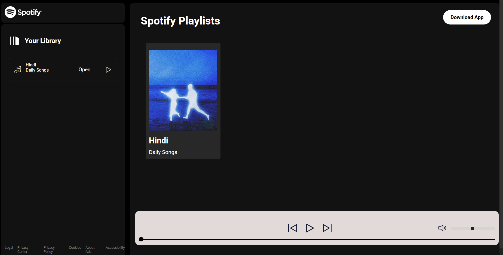

It's the main home page of our spotify and it has 1 playlist rn cause i haven't added more and when i'll need smth more ill just add it to hc cdn and paste the link in playlist.json, and songs in songs.json simple.

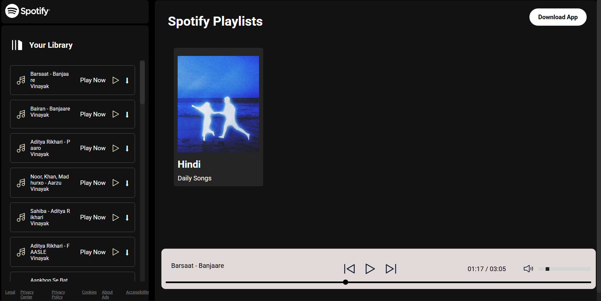

so, if you click on the playlist wherever you want in main spotify playlist or library songs list will appear in the left side in library

as you can see we have a volume slide bar, and song timeline bar, next btn, previous btn, play/pause/stop btn in the control panel so they all works if you want to turn volume or low, change music time to a specific line, or next like everything works

in the top right you can see download button when you press it, it redirects you to 

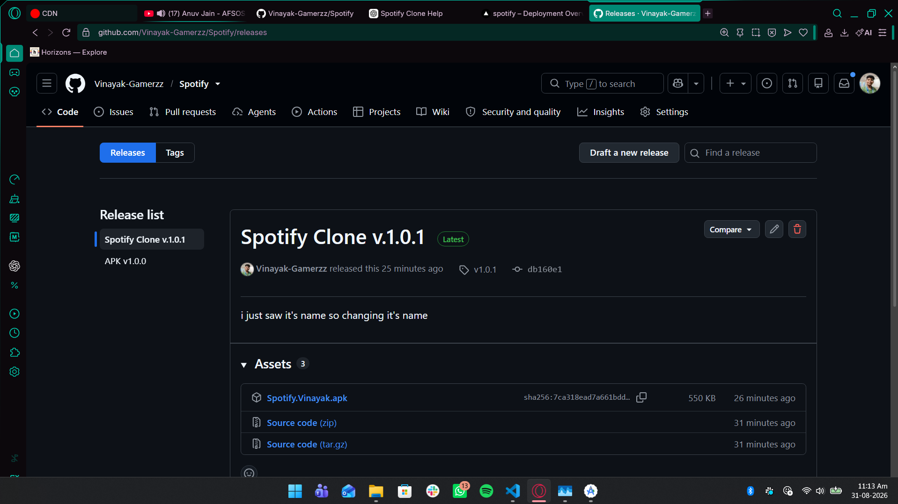

releases from where you can install apk file and enjoy your music ONLY FOR ANDROID rn :D

my spotify also has autoplay.

Now coming on Android version so lemme just bring my phone and click screenshots
NVM im showin you in android studio rn, my sis has my phone lawl
It's takin too much time to install phone in android studio im going to take my phone 

so here is all the images via phone but before that other written stuff

So, i made it in HTML, CSS, JS, & JSON but then also used vite and android launguage

# AI-USE 

i have used ai for debugging, and it was my first time to create app so i was unable to find where build, and stuff is so used ai for that, and the problems i faced - in app if i store music harcoded than in future everytime i want to add new songs i'll need to manually update that so chatgpt gave me idea to create playlist.json and songs.json so that it'll be automatically added and for that i needed a server to store songs i was using cloudfare but it was complicated idk where i reached in it, then i asked chatgpt can i use HC'S CDN so it told me yes, and how to so i uploaded everything there that's all My Lord heheheheh

# one imp thing

i have offline playing in app phone app but not in website cause yk it can't be happen but i am having the download btn in the library at all songs which dosen't work only in website cause you can't download it in any website but it fully works in android app as you can see in images and soon i will create a desktop app for this too so there download will be happening too yayy!

# IMAGES

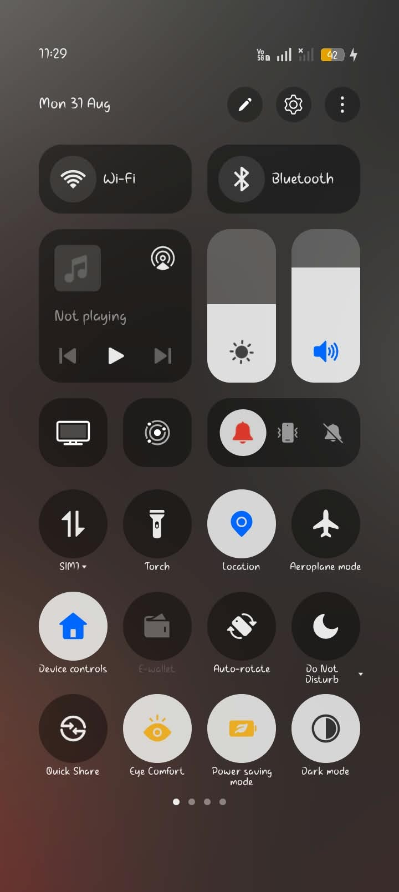

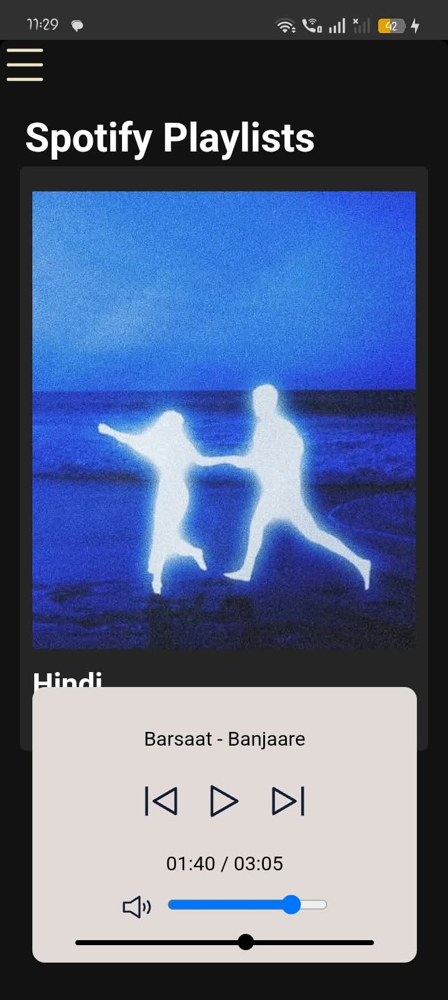

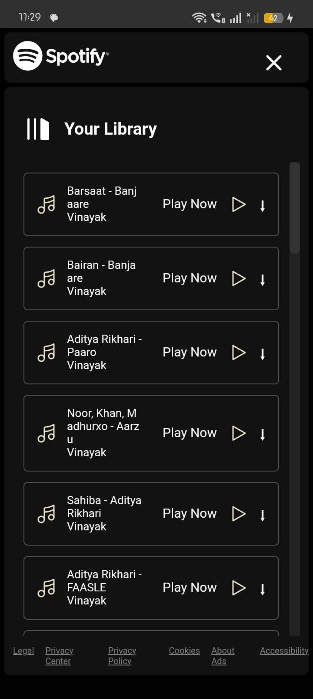

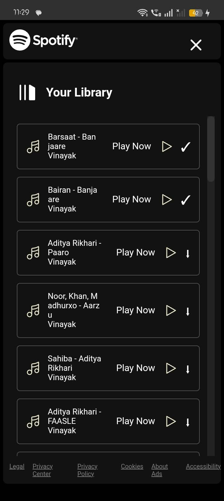

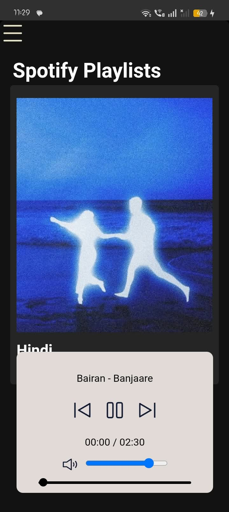

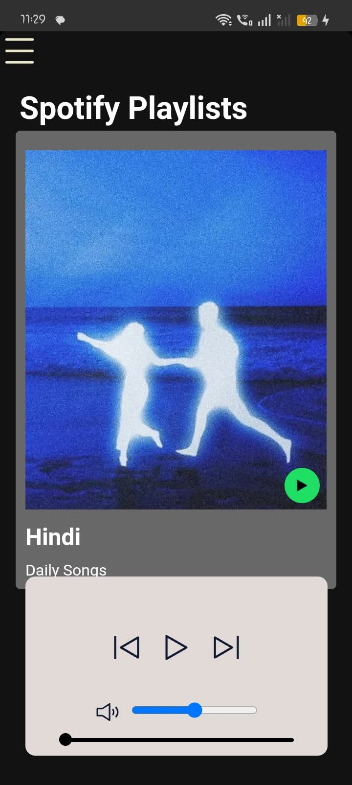

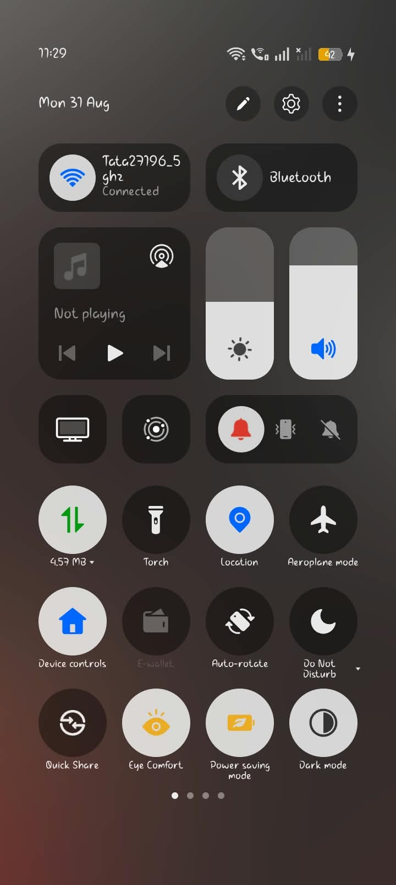

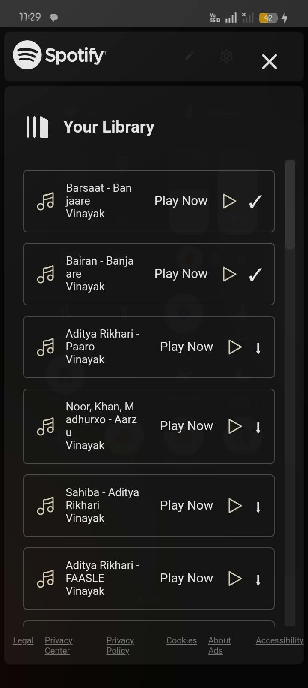

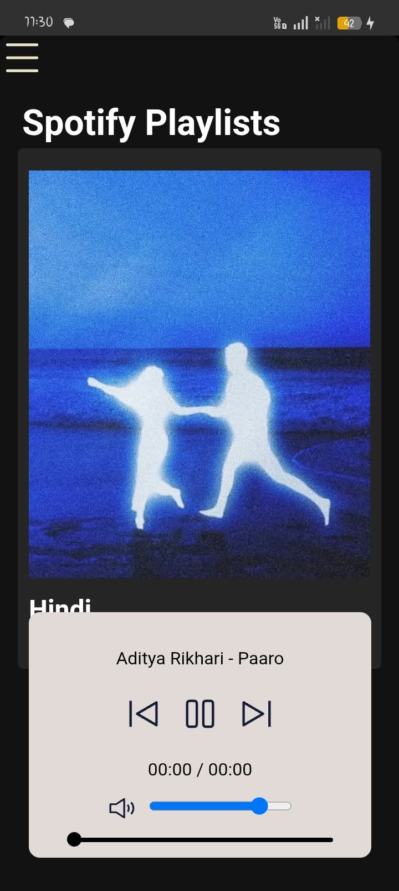

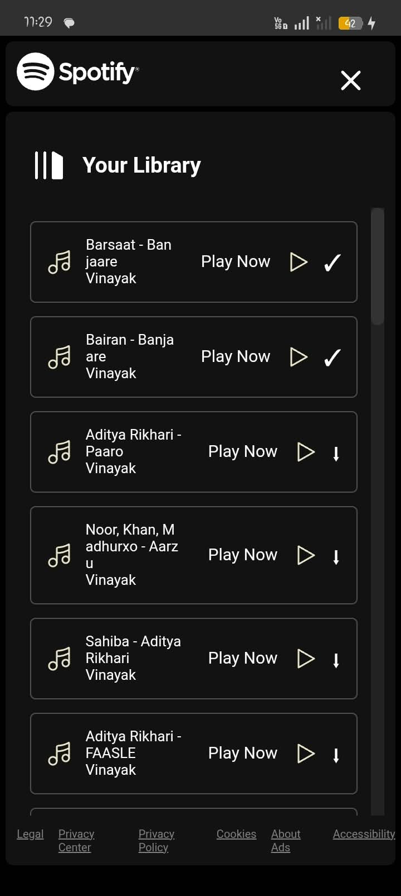

# MY FIRST APP!

I have used a tutorial of code by harry to create the website of spotify

then i created - it's app, most cool thing, offline playability on browser and android app both, i have made easy ways to add playlist and songs, and also search bar, and whatever you can see like everything is made by me just with the help of tutorial to create the website

# Upcoming Features

Admin Panel just go to the website and add songs no need to add them in the code or smth, and then downloadable music without increasing app's size and windows app!
